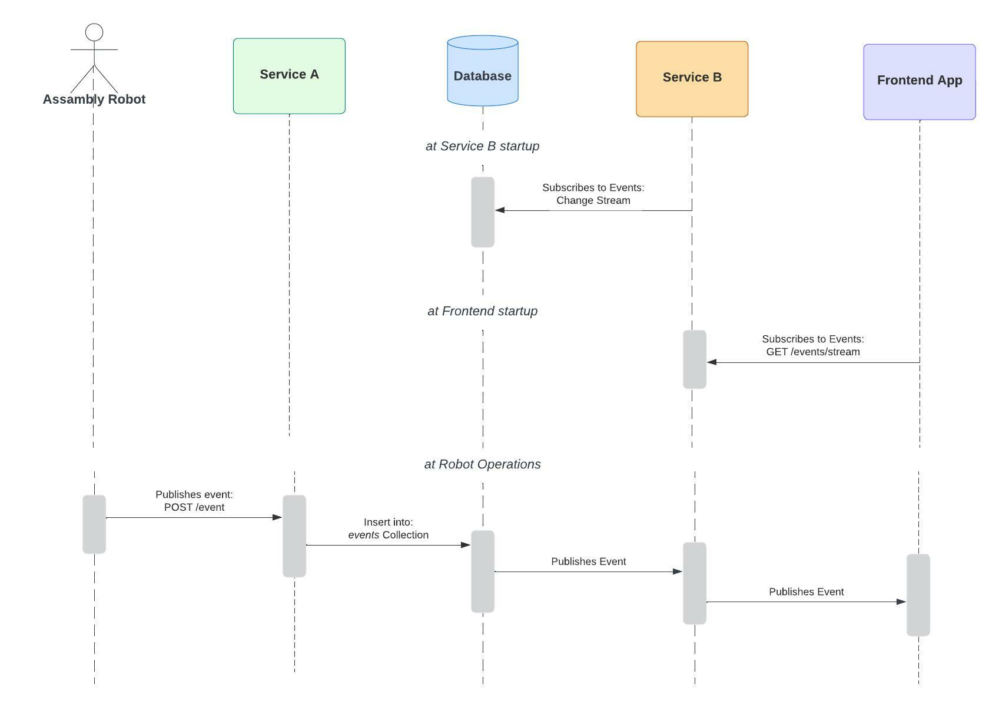

# Mongo Change Streams with Server Sent Events in Kotlin

The following project demonstrates how to publish events from a Mongo Change Stream through a Server Sent Event endpoint with SpringBoot and Kotlin.

## Overview

The demo includes two independent services:

- _ServiceA_: Can be used to add items to the database 
- _ServiceB_: Listens for any changes in particular database collection (events)

Change Streams is only supported by replica sets so this demo also includes a docker compose file to spin up a replica set that can be used for this example.



## Getting started

1. Spin up the Mongo Replica Set

```shell
docker-compose up -d
```

You can later tear down with:
```shell
docker-compose down
```

3. Run _ServiceA_
```shell
./gradlew serviceA:bootRun
```

5. Run _ServiceB_
```shell
./gradlew serviceA:bootRun
```

## Testing the events

1. Start listening for events in ServiceB

```shell
curl --request GET 'http://localhost:8081/events/stream'
```

3. Publish an event through ServiceA by adding an event to the database:
```shell
curl --request POST 'http://localhost:8080/events' \
--header 'Content-Type: application/json' \
--data-raw '{
    "inStage": "BODY",
    "outStage": "PAINT",
    "productId": "String",
    "info": "String"
}'
```

